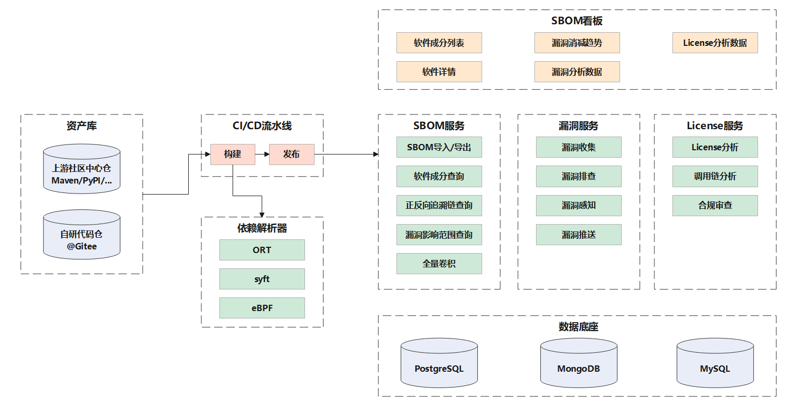
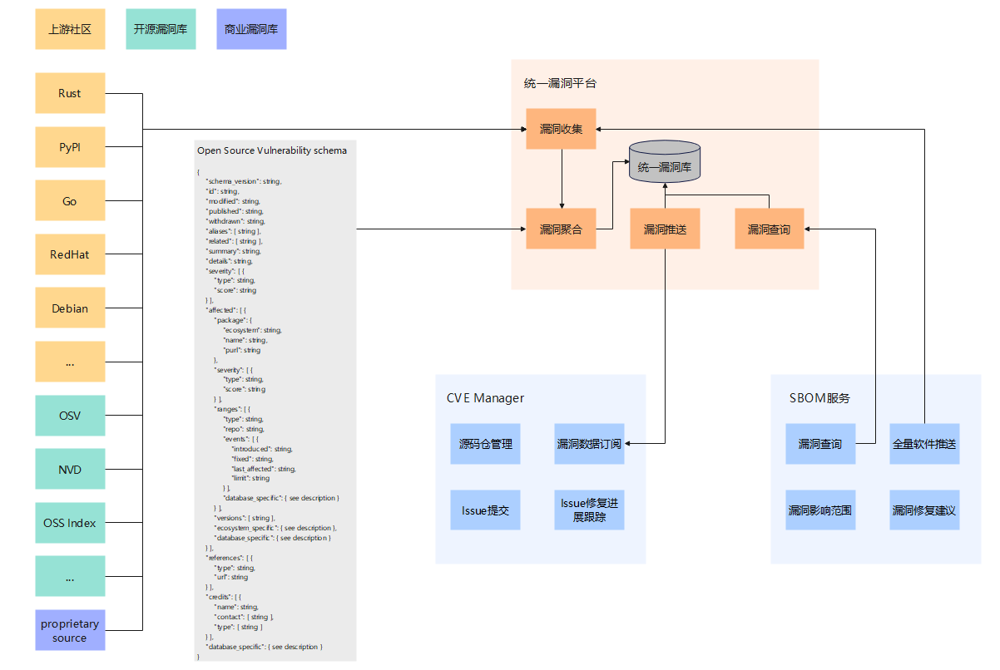
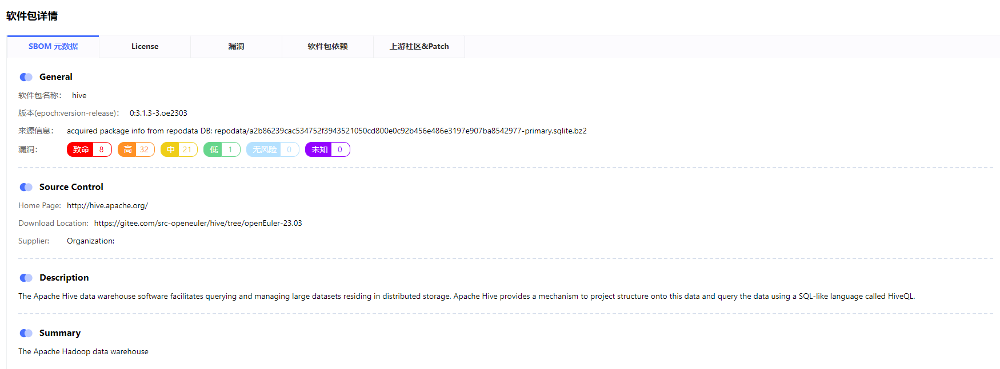
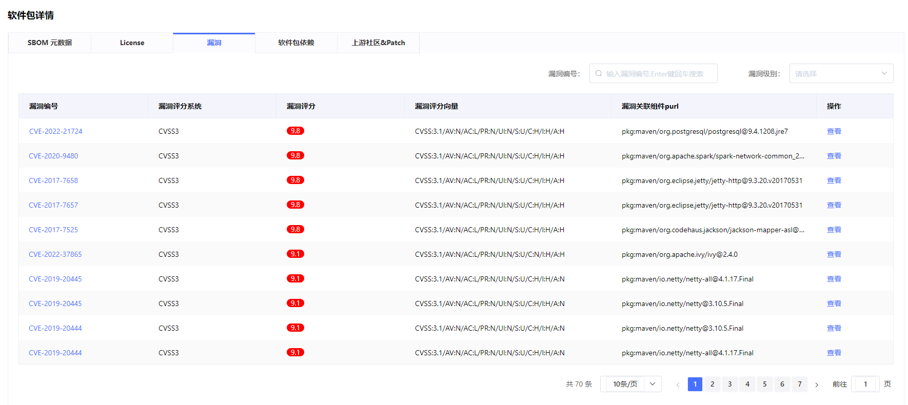
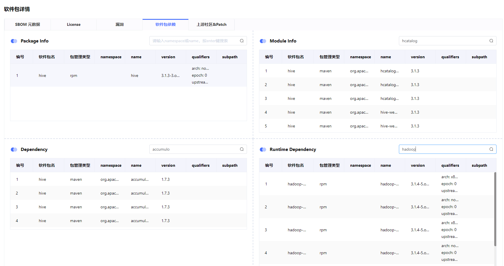
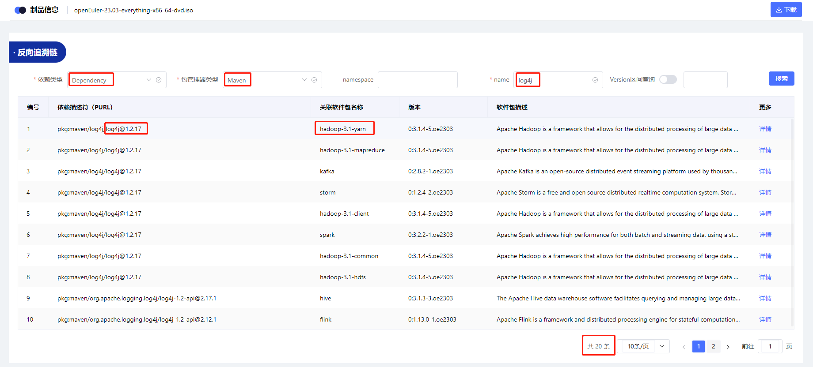
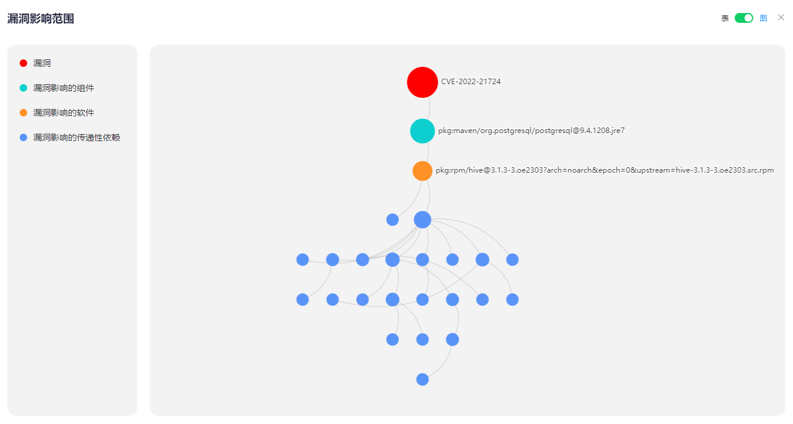
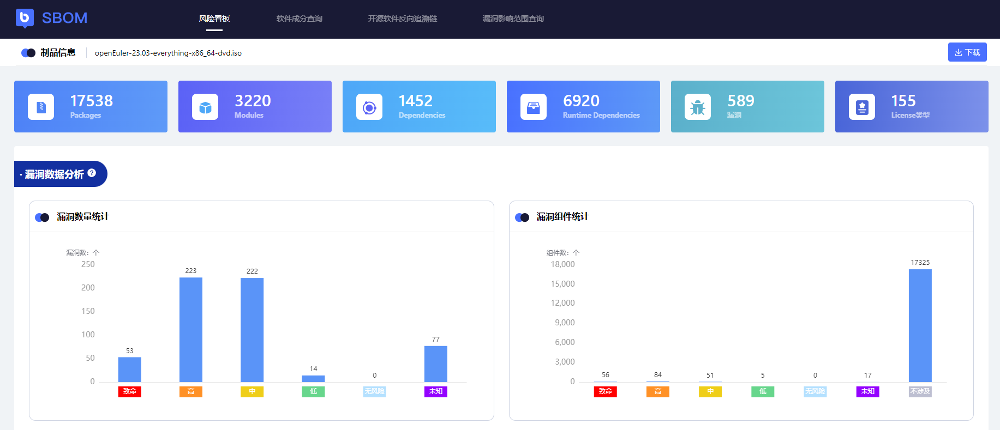
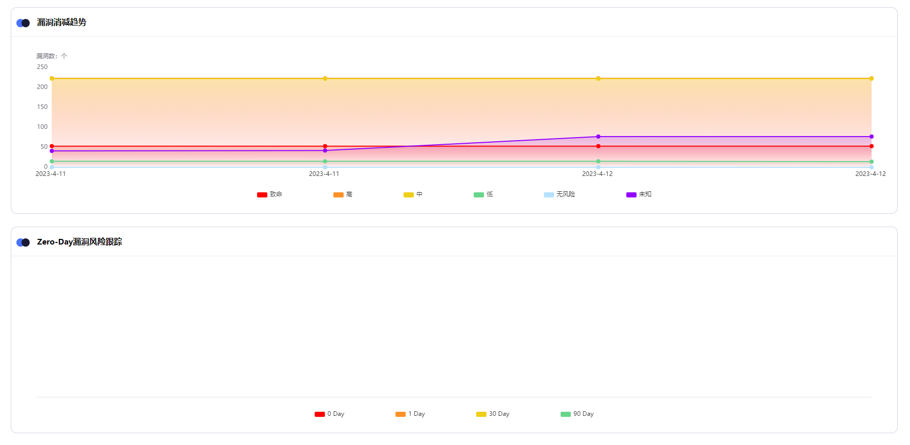

# 1 软件供应链安全面临的挑战和难点

## 1.1 开源软件行业洞察分析：使用无处不在、面临诸多风险

- 78% 软件使用了开源、81%代码库包含至少一个漏洞
- 88% 2年未升级版本号
- 30%没有License或定制申明

**涉及开源的行业多、开源代码占比很高，易被利用和攻击**

**去年TOP1漏洞存在于29%的代码库中、今年TOP1占比8%**

**NVD漏洞越来越多、CVE每月呈增长趋势、2022年预计增长到24495**

## 1.2 典型软件供应链安全问题事件

开源软件广泛应用在各行各业，已是现代化软件的基础底座。但随着开源软件在各行各业使用的日益增长，带来越来越广泛的零日漏洞威胁面，直接增加了使用开源软件的安全风险。比如：

- **Amnesia 33**：Forescout在4个开源TCP/IP 协议栈中发现33个zero-day安全漏洞，影响超过150家厂商的数百万智能和工业产品和设备
- **Ripple 20**：物联网安全风暴、JSOF安全研究人员在Treck TCP/IP软件库中发现19个zero-day安全漏洞，影响70多家厂商的全球十亿台联网设备
- **Apache Log4j2**：被曝存在严重高危的远程代码执行漏洞，攻击难度低、影响人群广泛，被称为“史诗级”高危漏洞
- **‘围剿’ 俄罗斯，开源无国界？**：30+开源项目加入了对俄罗斯的抵制，开源软件的伦理道德和安全性正在遭遇前所未有的挑战其中甚至包括亚马逊（AWS Terraform
  modules）和Oracle等科技巨头的项目，也不乏MongoDB、pnpm、es5-ext、Drupal、RedisDesktopManager等流行项目
  例如：Vue-cli 包遭遇供应链投毒，而被投毒的 node-ipc 包在 npm 上每周下载量超百万+

很多组织和企业在漏洞爆发很长时间内也无法判断是否受此漏洞影响，也间接说明了当下很多组织与企业缺乏对开源软件的有效管理和自动化的工程手段。

## 1.3 灵魂拷问

- **如何判断我是否受影响？**
  在大规模软件产品中要分清楚“我依赖了谁？谁依赖了我？”，建立可追溯的软件正反向依赖关系全链路。
- **如何检测和修复软件供应链攻击？**
  前提是需要建立现代化的DevSecOps软件工程体系：依赖分析、License分析、漏洞分析等均需要从人工排查转向到工程自动化。

## 1.4 识别软件依赖难点

- **开发语言多、构建框架/包管理器多、多语言混合构建**

  需要根据不同应用场景、需要开发自动化工具识别软件依赖

| 语言&其它类型      | 构建框架/包管理器                                                              |
| ------------------ | ------------------------------------------------------------------------------ |
| Java(4+)           | Ant,Maven,Gradle,SBT                                                           |
| python（5+）       | Pip,pipenv,poetry,esay_install,Conda                                           |
| JS(2+)             | npm,Yarn                                                                       |
| Go(2+)             | Go module,Go vender                                                            |
| Rust(1)            | Cargo                                                                          |
| C/C++(3+)          | RPM,Conan包管理依赖,Cmake/Ninja等构建框架引入的依赖,Git Source源码引入的依赖等 |
| OS镜像(6+)         | VM Image,Docker Image,各种类型OS安装包如rpm,deb,nix等包管理器的依赖管理        |
| 跨语言构建框架(6+) | Bazel,Gradle,Buck,Pants,Please,Blade构建系统的依赖管理策略                     |
| 其它               | ...                                                                            |

- **按照软件栈行业领域划分如”端-边-云“分场景细分是复杂的、需要结合实际软件栈，例如软件架构、构建框架、涉及语言、部署形态等分析软件成分**

例如如下类别可能涉及多种编程语言，依赖软件多种类型，并且可能上层封装了符合自己构建框架脚本，那么获取其精准依赖关系就需要结合软件栈和软件架构详细分析
- 固件
- 操作系统，里面细分了服务器领域（Redhat、openEuler、Debian、openSUSE、NixOS、Arch Linux、Fedora等，里面还分不同体系如RPM,DEB体系等）、嵌入式领域（ Embedded Linux）、手机端领域如Android/IOS
- 内核
- 驱动
- 中间件
- 数据库
- 编译器
- 编程语言与编程框架
- 云原生的IaaS、PaaS、SaaS、DaaS平台
- 应用层软件

- **直接依赖软件引入的传递性依赖软件多、且依赖层次深**

例如Java单个Jar包涉及到的传递性依赖规模可达到：1:50 。使用Maven框架的dependencies tree命令，可以看出一个组件引入了哪些传递性依赖、继承依赖等信息。

- **各构建框架均有自己的仲裁规则**

多样性的版本仲裁规则：最小版本选择、最短路径优先、依赖排除原则、第一声明优先、覆盖优先原则、依赖锁优先；需要根据不同构建框架的依赖管理策略来排除实际不需要的依赖。

例如：Maven

| 仲裁策略         | 描述                                                                                                                                        |
| :--------------- | :------------------------------------------------------------------------------------------------------------------------------------------ |
| 最短路径优先原则 | 相同软件、优先去依赖树的深度浅的版本号、即选路径长度短的版本号                                                                              |
| 优先声明原则     | 相同软件、当依赖树深度一样时、优先选择第一个加载的版本号                                                                                    |
| 覆盖优先原则     | 子POM内声明的版本号优先于父POM中的依赖申明的版本号                                                                                          |
| 后声明则优先     | 当同一个POM文件申明了相同软件、不同的版本，后申明的覆盖前面的；通常不建议这么写POM                                                          |
| 依赖排除原则     | POM里配置exclusion来排除传递性依赖、通常用来解决版本冲突问题；我们不想通过 A->B->C>D1 引入 D1 的话，那么我们在声明引入 A 的时候将 D1 排除掉 |

例如： Go Module， “最小版本选择”，涉及replace、exclude、upgrade等操作。
Exclusion:

Replacement:

- **各构建框架的语义化版本号**

只有真正执行构建才能得到真实的依赖软件版本号，通过静态分析无法得到实际依赖的软件版本号。

语义版本控制（semver）是旨在解决此问题的标准：用一组简单的规则及条件来约束版本号的配置和增长。这些规则是根据开放源码软件所广泛使用的惯例所设计。

> *参考：*

> [https://semver.org/lang/zh-CN/](https://semver.org/lang/zh-CN/)

区间版本号（version ranges）的示例：

- **依赖软件作用域范围、依赖类型**

  各包管理器支持按使用场景对依赖项进行分组，定义类似scope的依赖作用域范围。通过作用域来界定依赖在以下场景的参与情况：编译、工具依赖、测试依赖、运行时依赖等，例如：

| 构建框架 | 依赖作用域范围                                          |
| -------- | ------------------------------------------------------- |
| maven    | compile,test,runtime,provided,system                    |
| pipenv   | packages,dev-packages                                   |
| poetry   | tool.poetry.dependencies,tool.poetry.dev-dependencies   |
| npm/yarn | devDependencies,dependencies                            |
| cargo    | dev-dependencies,dependencies,build-dependencies,target |
| rpm      | Requires,BuildRequires                                  |
| ..       | ...                                                     |

我们以Maven构建框架为例，Maven根据Pom描述的scope，在打包时决定依赖的软件包是否打入自己的产品包

- **冗余依赖、依赖缺失问题**

高阶语言包管理器：申明了却没有使用的依赖需要排除(Unused declared dependencies ), 没有申明却使用了的依赖要补上(Used undeclared dependencies)

- **构建工程不规范导致依赖不准确**

| 问题类型             | 问题影响                                                                                 |
| -------------------- | ---------------------------------------------------------------------------------------- |
| Spec定义不规范       | 传递性依赖并未单独打RPM包，依赖并非全封闭、Spec的shell、python脚本注入式引入外部依赖软件 |
| 构建来源不可信       | 源码仓里直接存放jar包、且定制修改过，不是上游社区的原始包                                |
| 层层打外部依赖包     | 不规范的打RPM或jar包,导致打包层次深、依赖解析规则无法适配                                |
| 引入非必要的冗余依赖 | 部分Java的RPM包引入了sources.jar,javadoc.jar，sample,demo,test的包应该去除               |
| ..                   | ...                                                                                      |

## 1.5 获取开源软件扩展元数据信息完备性的难点

### 1.5.1 漏洞信息不全

* a. CVE漏洞待分析，导致信息不全如元数据丢失、无CPE、无官网地址等
  
* b. CVE References部分未指明修复patch
  
* c. CVE的文字描述差异大，无法100%判断影响软件版本区间
  
* d. 漏洞无法精准定位到jar、whl等高阶框架使用的包，开发人员界定难、修复难
  

### 1.5.2 License、上游社区等信息不全、不准

- Spec里面人工填写License与实际开源软件License不符
- 传递性依赖软件License需要补充解析
- 开源软件的上游社区信息数据库缺失或不准
- 部分开源库&商业库的License等信息老旧未更新，不一定100%准确

# 2. 洞察SBOM技术生态

## 2.1 什么是SBOM？

SBOM是一种正式标准化的、机器可读的元数据，它唯一地标识软件组件及其内容；也可能包括版权和许可证等成分数据。SBOM旨在跨组织共享，有助于提供软件供应链成分清单与透明度。如今主流SBOM标准包括SPDX2、CycloneDX、SWID。

致力于软件安全供应链透明的数据底座、跨组织共享、并贯穿SDLC，未来趋势将作为软件交付件必要清单。

> *参考：*

> [https://www.ntia.gov/files/ntia/publications/sbom_minimum_elements_report.pdf](https://www.ntia.gov/files/ntia/publications/sbom_minimum_elements_report.pdf)

> [https://spdx.dev/](https://spdx.dev/)

> [https://cyclonedx.org/](https://cyclonedx.org/)

> [https://nvd.nist.gov/products/swid](https://nvd.nist.gov/products/swid)

## 2.2 SBOM的消费场景与用途

- **场景**：软件供应链安全管理、安全漏洞管理、安全应急响应，高可信安全应用管理
- **用途**：能帮助软件生产商、购买者和运营商更高效的识别软件成分、排查License风险/合规风险/安全漏洞影响风险、履行义务声明等

## 2.3 为什么一定是SBOM？

**问**：没有SBOM社区，企业能识别软件成分并管理好开源软件的合规风险、漏洞风险吗？

**答**：其实也是可以的，因为在SBOM没有普及之前业界本身就有很多一系列的商业解决方案和开源工具解决方案，业界归类叫SCA（Software Composition
Analysis）。已识别开源软件（OSS）的组件及其构成和依赖关系，并识别已知的安全漏洞或者潜在的许可证授权问题等。

**例如**：WhiteSource、Synopsys、Snyk、Sonatype、Flexera、Veracode、GitLab、FOSSA、JFrog均提供了企业级的解决方案，同时这些公司也在逐步支持SBOM的标准协议，如导出业界标准的格式如SPDX、CycloneDX

**SBOM作为业界数据标准的主要用途提供了**： 跨组织（第三方供应商、开源社区、公司内部等）的交换数据基础；和统一各种开源安全工具链的输出、并以此建立生态。

## 2.4 SBOM安全吗？

软件物料清单打个比方就如药品的配方成分，其实是一把“**双刃剑**”。站的角度和出发点不一样，其安全性也有所不同。

- 企业可以让下游供应商提供SBOM、，政府也可以要求企业提供SBOM; 在甲方来看对自己是安全的
- 但国际形式分析如果西方国家拿到了任意国家的SBOM清单，那么利用其数据可以进行更有效的限制。如果是军工企业对安全性要求高，肯定不会对外公布SBOM

所以SBOM虽然定义了行业标准，但SBOM是否要公开、SBOM是否作为发布件一起交付还是需要从自己公司与国家安全上整体考虑。

## 2.5 SBOM技术生态

**不仅仅是数据标准，还需开源&商业生态链配套**。

- SBOM标准的设计是起点: 标准的推广离不开一个活跃的生态。SBOM的一大特征是机器可读，因此SBOM社区需要提供完善的基础设施，以供开发者和厂商方便地根据SBOM标准完成SBOM的生成、消费、转换
- SBOM标准生态离不开实际的高阶应用：例如漏洞感知、license合规支持；没有高阶应用等消费场景支持的SBOM标准只不过是空中楼阁

NTIA将SBOM工具划分为：**三大类、九小类**。SBOM标准社区需要尽量提供所有分类的工具，以满足用户的基本使用场景

### 2.5.1 SBOM最小集定义

美国国家电信和信息管理局(National Telecommunications and Information Administration)发布SBOM最小集的定义：
数据字段是关于必须捕获和维护每个组件的基础数据，以便在整个软件供应链中跟踪组件，并基于此扩展License和漏洞库等其他数据字段

| 数据字段       | 描述                                                             |
| -------------- | ---------------------------------------------------------------- |
| 供应商名称     | 创建、定义和标识组件的实体的名称。                               |
| 组件名称       | 分配给原始供应商定义的软件单元的名称。                           |
| 组件的版本     | 组件版本号、供应商用来指定软件从先前标识的版本发生变化的标识符。 |
| 其它唯一标识符 | 用于标识组件或用作相关数据库的查找键的其他标识符。               |
| 依赖关系       | 软件依赖关系、表征上游组件 X 包含在软件 Y 中的关系               |
| SBOM数据的作者 | 为此组件创建SBOM数据的实体的名称。                               |
| 时间戳         | 记录SBOM数据组装的日期和时间。                                   |
| **推荐的数据** |                                                                  |
| 组件的哈希     | 组件的唯一哈希，以帮助允许列表或拒绝列表。                       |
| 生命周期阶段   | SDLC 中捕获 SBOM 数据的获取的阶段。                              |

### 2.5.2 SBOM唯一标识符：PURL（Package URL）

- **PURL**: 描述软件包唯一性的一种标准协议、统一的方式识别和定位软件包、用于以跨编程语言、包管理器、打包约定、工具、API 和数据库等
- **PURL表达式**：采用scheme:type/namespace/name@version?qualifiers#subpath 描述软件包的唯一性

> *参考：*

> [https://github.com/package-url/purl-spec](https://github.com/package-url/purl-spec)

### 2.5.3 SBOM-->SPDX生态洞察

- **SPDX社区提供了多语言类库和工具**：
  能够完成SBOM生成、消费、转换等任务，语言类库当前支持Java、Golang、Python、JavaScript等主流编程语言

- **众多主流开源/商业工具及解决方案**：
  支持：生成/消费SPDX SBOM、license合规、漏洞管理等
  

### 2.5.4 SBOM--> CycloneDX生态洞察

- **CycloneDX社区同样提供了多语言类库和工具**：
  能够完成SBOM生成、消费、转换等任务，语言类库当前支持Java、Golang、Python、JavaScript、PHP、.NET等主流编程语言
  
- **众多主流开源/商业工具及解决方案**：
  支持生成/消费CycloneDX SBOM、license合规、漏洞管理等
  

### 2.5.5 洞察Linux基金会：基于SBOM开源软件供应链安全解决方案

oss-review-toolkit：基于SBOM提供完整解决方案并对接主流第三方商业工具，开源工具的集成：vulnerablecode、ScanCode、SCANOSS、Fossid、Sonatype

> *参考：*

> [https://github.com/oss-review-toolkit/ort](https://)

### 2.5.6 洞察微软：基于SBOM开源软件供应链安全解决方案

- SBOM Generator：基于SPDX的跨平台、全场景支持（涉及语言、包管理、操作系统等，包括：NPM、NuGet、PyPI、CocoaPods、Maven、Golang、Rust Crates、RubyGems、containers、Gradle、Ivy、GitHub public repositories）

> *工具参考：*

> [https://github.com/microsoft/sbom-tool](https://github.com/microsoft/sbom-tool)

备注：此工具刚开源、并未正式Release、当前处在v0.2.2版本、依赖解析覆盖场景待补全。

- 基于SBOM的存储&消费、完整性验证、开源合规声明、 安全监控等配套解决方案
  

### 2.5.7 SBOM生态工具链多、我们还需要做什么

如果实际去使用过SBOM开源的一些列工具链，例如O.R.T、syft、sbom-tool。在实际使用的过程中会发现要做成一个解决方案往往没那么简单。当前工具链有很多要定制化的，而且覆盖场景都全需要增强。例如

- 社区提供的均是单点的依赖解析工具、基于源码、镜像直接生成SBOM单一文本
- 如果以产品整个视角来看：SBOM数据需要聚合、正反向依赖关系需要映射等；SBOM的元数据就需要依托数据库存储来支持各种数据的查询、风险看板分析、追溯链的可视化等
- 开源的工具对接的License、漏洞数据库不健全；或者对接了一些开源的库，只是做了一个原型，其底层数据是大量需要补充

  举例：

  - Sonatype OSS Index：最新漏洞公布稍有滞后
  - vulnerablecode：聚合了一些列开源的漏洞库，项目处于孵化中，系统准确性、完整性有待加强
  - Grype：漏洞库使用sqlit保存数据， 在数据库稳定性和分布式消费场景下会有不足，详细请参考[https://github.com/anchore/grype](https://github.com/anchore/grype)
  - Open Source Vulnerabilities (OSV)：漏洞库当前只收集了3万多个漏洞，漏洞库的完整性需要进一步补充
    
- License如果使用ScanCode对源码扫描会十分耗时，不可能每次都把自身软件和传递依赖软件源码全量扫描； 实际产品化需要增强
- 商业解决方案如WhiteSource、Synopsys、Snyk、Sonatype、Jfrog等能力上也是各有优缺点；并且产品化后也需要根据产品实际扫描准确性和问题，购买定制化的增强服务、或提供顾问支持产品化落地
- 合规的判断依据需要深刻理解各License的风险
- 工具只是辅助，实际还需要看软件的规范性。不然无法获得精准的依赖，实际落地的时候会发现依赖识别多了或少了都会影响漏洞误推或少推。

# 3. SBOM的工具链解决方案

## 3.1 开源社区SBOM解决方案应用架构全景图

1. 作业层：围绕社区开发者作业流，任何发布二进制能自动生成SBOM、自动提交Issue
2. 服务层：提供原子化服务解耦，如SBOM生成&格式转化工具套件、License服务、漏洞排查服务、漏洞感知、开源片段引用扫描服务等
3. 数据层：提供SBOM数据库存储、核心License数据库、漏洞数据库、开源片段数据库等数据资产
   

## 3.2 SBOM数据流向图

1、数据生产&存储：SBOM基于CI/CD流水线自动生成，随制品一起归档存储，实现发布二进制与SBOM关联

2、数据消费：基于SBOM的License合规、漏洞排除与感知

3、社区门户：依托于各社区门户网站对全量SBOM信息进行管理，并与源码仓交互。进行issue提交、漏洞修复、开源合规履行义务声明

## 3.3 SBOM数据组装与颗粒度

**面向软件包的一包一SBOM、一包一PURL**

## 3.4 SBOM软件成分识别：全场景支持、精准构建依赖解析

## 3.5 License合规服务：源码成分分析、片段扫描、血缘分析

建设统一的License数据库、License合规分析应用、统一集成调度，补充完整的SBOM核心字段：License、Copyright、obligation、limitation等
底层借鉴ScanCode、SCANOSS扫描能力完善License数据库的完备性、准确性和实时性

## 3.6 统一漏洞库服务：依托已公布和未纰漏的开源&第三方漏洞库

基于SBOM进行漏洞排查、修复、感知，SBOM作为输入支持使用PURL镜像查询，漏洞服务提供统一的API进行查询，社区门户桌面进行统一漏洞应用管理，源码仓建立关联，让社区开发第一时间感知

# 4. 开源社区SBOM落地效果演示

## 4.1 SBOM软件成分查询

- 正向依赖追溯链（**我依赖了谁？**），软件包名支持模糊与精确检索

  
- 单软件的SBOM**元数据详情**，覆盖SBOM基础要素与扩展字段、完备了软件的自身可追溯性包括软件名、版本、源码、供应商、上游社区、下载地址等

  

- 单软件的License与漏洞详情，漏洞基于purl定位到组件

  

  

- 单软件正向软件全链路追溯（软件包、内部自身组件、传递性依赖、运行时依赖）

  

- 单个软件反向追溯链全局可视（**在整个产品中我被谁依赖了？**）--为漏洞排查奠定基础

  

- 单个漏洞影响范围追溯、基于反向依赖链、推到漏洞的感染的全路径、为漏洞修复提供了有利帮助

  

## 4.2 SBOM风险看板

- **全局大盘（软件成分、License、漏洞）**

  1. openEuler中ISO包、Packages(RPM包)、Modules(如RPM内部组件如Jar包)、Dependencies(Modules依赖的Jar包)、Runtime Dependncies(运行时需要依赖的RPM包)
  2. 涉及多少License类型，多少漏洞，详细的漏洞影响等级分布图、受漏洞影响的组件分布图

  
- **按时间分布的漏洞消减趋势、Zero-Day漏洞趋势**
  
- **License合规分析、License类型详情分布**

  1. 统计：有多少软件没有License、哪些软件涉及多License
  2. 分析：自动化判断多少不合规的License分布图、每种License使用广泛度的详情分布图

  
- **同时支持SPDX/CycloneDX标准下载、并支持不同格式导出**

  SBOM可随发布包一起交付给第三方

  

# 5. 下一步计划

当前整个SBOM软件生态处在起步阶段，展望未来基于SBOM可扩展点比较多、其配套的服务生态也会逐步完善。

